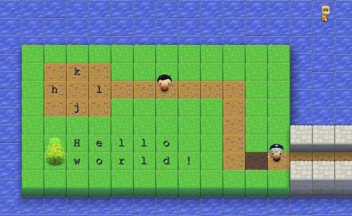

# Command

command line interface 명령어를 정리합니다.

#### pwd

현재 위치한 폴더를 출력하는 명령어입니다.

```shell
pwd
```


#### ls

list의 약자로 현재 폴더에 있는 모든 파일과 폴더를 출력하는 명령

``` shell
ls # 숨김 폴더는 출력 안함
ls -a # 숨김 폴더, 파일까지 모두 출력함
```


#### cd

change directory의 약자로 폴더를 이동하는 명령어입니다.

```shell
cd <PATH> # 이동하고 싶은 폴더를 PATH에 입력
```


#### 생성

- `touch`: 파일을 생성하는 명령어
- `mkdir`: 폴더를 생성하는 명령어


#### vi

vim 에디터를 사용하여 편집

연습할 수 있는 사이트 [빔어드벤쳐](https://vim-adventures.com/)





